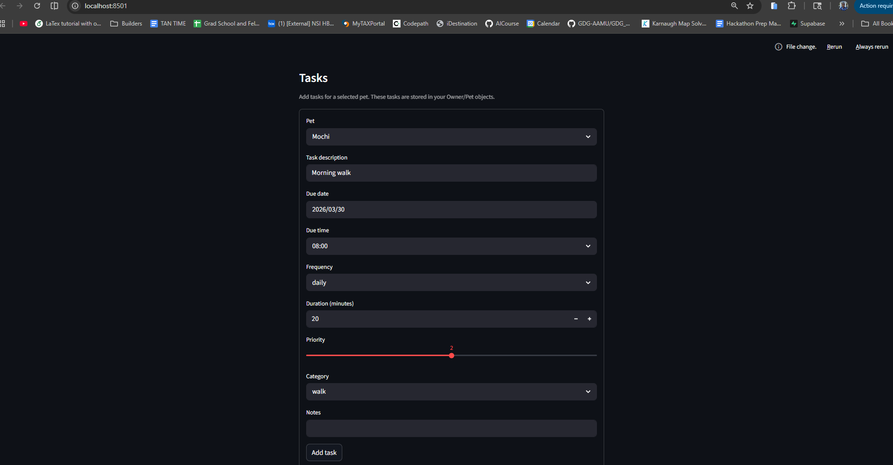
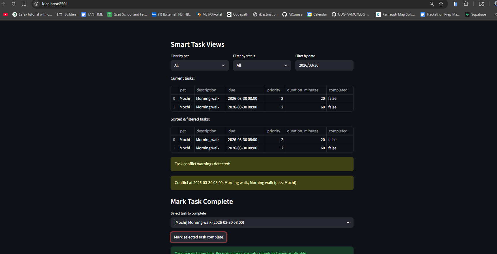

# PawPal+ (Module 2 Project)

You are building **PawPal+**, a Streamlit app that helps a pet owner plan care tasks for their pet.

## Scenario

A busy pet owner needs help staying consistent with pet care. They want an assistant that can:

- Track pet care tasks (walks, feeding, meds, enrichment, grooming, etc.)
- Consider constraints (time available, priority, owner preferences)
- Produce a daily plan and explain why it chose that plan

Your job is to design the system first (UML), then implement the logic in Python, then connect it to the Streamlit UI.

## What you will build

Your final app should:

- Let a user enter basic owner + pet info
- Let a user add/edit tasks (duration + priority at minimum)
- Generate a daily schedule/plan based on constraints and priorities
- Display the plan clearly (and ideally explain the reasoning)
- Include tests for the most important scheduling behaviors

## Features

- Owner and pet profile management in the Streamlit UI.
- Task creation with due date/time, priority, duration, category, and frequency.
- Time-based scheduling that selects tasks within owner daily availability.
- Sorting by due time for clear chronological planning.
- Filtering by pet, completion status, and selected date.
- Conflict warnings for tasks scheduled at the exact same time.
- Daily/weekly recurrence that auto-creates the next task occurrence on completion.

## Getting started

### Setup

```bash
python -m venv .venv
source .venv/bin/activate  # Windows: .venv\Scripts\activate
pip install -r requirements.txt
```

### Run the App

```bash
streamlit run app.py
```

### Run the CLI Demo

```bash
python main.py
```

### Suggested workflow

1. Read the scenario carefully and identify requirements and edge cases.
2. Draft a UML diagram (classes, attributes, methods, relationships).
3. Convert UML into Python class stubs (no logic yet).
4. Implement scheduling logic in small increments.
5. Add tests to verify key behaviors.
6. Connect your logic to the Streamlit UI in `app.py`.
7. Refine UML so it matches what you actually built.

## Smarter Scheduling

PawPal+ now includes lightweight algorithmic behaviors that make planning more intelligent and practical:

- Sorting by time: tasks can be ordered by due datetime so out-of-order input is normalized for review and planning.
- Filtering by status/pet: tasks can be filtered by pet name, completion state, and date to support focused views.
- Recurring task automation: completing a daily or weekly task auto-creates the next occurrence using date offsets.
- Basic conflict detection: the scheduler detects exact-time collisions and returns warning messages instead of failing.
- Next available slot suggestion: the scheduler can recommend the earliest open time block for a new task duration.
- JSON persistence: owner, pets, and tasks are saved to `data.json` and loaded when the app starts.

These features are demonstrated in the terminal demo (`main.py`) and used by the scheduling logic in `pawpal_system.py`.

## Stretch Features Implemented

1. Advanced Algorithmic Capability
- Added `Scheduler.find_next_available_slot(...)` to scan the day and return the first gap large enough for a requested task duration.
- The Streamlit UI exposes this via a "Suggest slot" action.

2. Data Persistence Layer
- Added `Owner.save_to_json(...)` and `Owner.load_from_json(...)` for full system persistence.
- The app now loads from `data.json` at startup and saves automatically after profile, pet, and task changes.

### Agent Mode Notes

Agent Mode was used to plan these multi-file changes before implementation. The planning output helped define method signatures (`find_next_available_slot`, `save_to_json`, `load_from_json`), JSON schema decisions, and UI integration points to keep updates consistent across backend and Streamlit layers.

## 📸 Demo

### Streamlit Screenshots





## Testing PawPal+

Run the automated tests with:

```bash
python -m pytest
```

Current tests cover:

- Task completion state updates.
- Adding tasks to a pet.
- Scheduler time sorting correctness.
- Recurring task creation after daily task completion.
- Conflict detection for duplicate due times.
- Filtering by pet, completion status, and date.

Confidence Level: ★★★★☆ (4/5)
